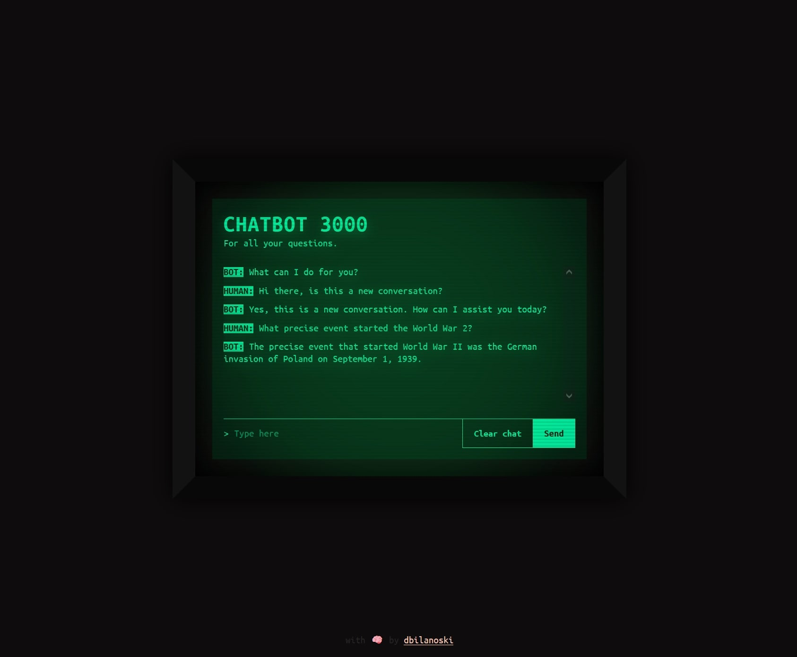

# Chatbot3000
> A helpful chatbot styled in a retro cyberpunk manner where openai api usage is explored.

## Table of contents
* [General info](#general-info)
* [Screenshots](#screenshots)
* [Live Demo](#live-demo)

## General info
As a part of my CS50x course certification, I decided to utilize openai in my final project so I could learn additional and relevant technology. This chatbot application is fetching completions fron openai gpt 3.5 turbo model and persisting the data in the browser's local storage. It utilizes Netlify serverless function to safely store the sensitive data and is styled in a retro cyberpunk fashion using plain css.

## Screenshots

## Live Demo
You can see live demo [here]().